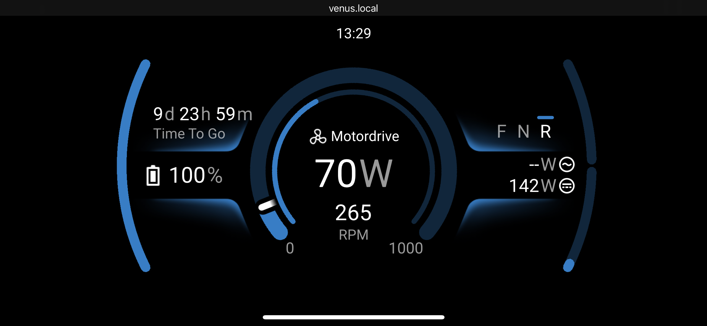

# dbus-sevcon

Venus OS driver for Sevcon Gen4 controller: enables communication and motordrive data reporting via D-Bus.

## How to connect the Sevcon controller to a Victron GX product

Victron GX products: https://www.victronenergy.com/live/venus-os:start.  

Connect the CAN output from the Sevcon controller to the Victron product's VE.Can port #1.

A modified RJ45 cable can be sufficient.

| RJ45 pin # | Controller pin |
|------------|----------------|
| 7 (Brown/White) | 13 or 16 (CAN High) |
| 8 (Brown) | 24 or 27 (CAN Low) |

Sevcon gen4 manual: https://www.thunderstruck-ev.com/images/Gen4%20Product%20Manual%20V3%204.pdf

## How to install the driver

1. Download the latest `venus-data.zip` from the [releases page](https://github.com/citolen/dbus-sevcon/releases).
2. Put `venus-data.zip` on an SD card or USB flash drive.
3. Put the SD card or USB flash drive into the Victron GX product.
4. Reboot.
5. Once rebooted, remove the SD card or USB flash drive.
6. Reboot again.

Once those steps are completed, if the controller is turned on and correctly connected, it will start reporting a motordrive.

## Where is the driver installed

The driver is stored in `/data/dbus-sevcon`.  
A symlink is created to `/opt/victronenergy/service/` to ensure it's loaded as a service on boot.

### How to remove the driver

SSH into venus. (See [guide on how to](https://www.victronenergy.com/live/ccgx:root_access))

Run:  
`rm /opt/victronenergy/service/dbus-sevcon`  
`rm -rf /data/dbus-sevcon`

## How does the driver work

Upon being installed, the driver will start looking for the Sevcon controller every 10 seconds.  
If one is detected, a new device (motordrive) will show up in Venus.  
The motor data will be refreshed once per second.

Turning off the engine/controller will remove the device.

> [!WARNING]
> The driver currently expects the controller to use CAN node ID 1. This will be configurable in the future.